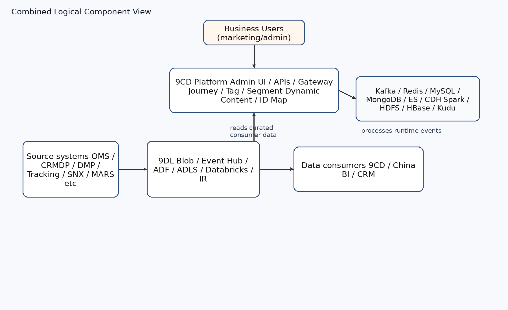

<!-- _class: lead -->
<!-- _paginate: false -->

# CDP Application Migration
## Heads-up & Context for the Infra Team

an early walkthrough of the planned change to the CDP application, so Infra has the big picture ahead of the migration project.

---

## Why CDP — Business Context

Michelin B2C is moving to a **Consumer Lifetime Value** model. Michelin China needs to:

- Deepen **direct** consumer relationships
- **Own** consumer data end-to-end
- Deliver a more **data-augmented** consumer experience

**The CDP application in scope is two layers working together**

| Layer | Role | Answers the question |
|-------|------|----------------------|
| **9DL** | Consumer **data lake** / data foundation | *How do we collect, clean, store, and serve China consumer data?* |
| **9CD** | Consumer **data platform** / activation layer | *How do we use that data to identify, segment, and engage consumers?* |

<strong>Coverage:</strong> 1st-party touchpoints + key 2nd/3rd-party ecosystems (Alibaba, Tencent, Bytedance, Bilibili, communities, selected offline).

<strong>Note:</strong> 9CD is <em>both</em> a <strong>data source</strong> and a <strong>data consumer</strong> of 9DL — the two layers are tightly coupled.

---

<!-- _class: split-context -->

## 2. High-Level System Context Diagram

9DL — Data foundation

<ul>
<li>Centralize consumer data from all China touchpoints</li>
<li>Standardize dimensions, metrics, and data mappings</li>
<li>Cleanse and consolidate raw data</li>
<li>Expose curated datasets to <strong>CDP, BI, CRM</strong> and other consumers</li>
</ul>

9CD — Activation

<ul>
<li>Automatic <strong>consumer ID mapping &amp; merge</strong></li>
<li>Automatic <strong>tagging</strong> and <strong>segmentation</strong></li>
<li><strong>Journey orchestration</strong> (automated / personalized)</li>
<li><strong>Dynamic content</strong> across channels (WeChat, SMS, landing pages)</li>
</ul>

<strong>Diagram (target context):</strong> <strong>CDP</strong> at the center — engagement channels (landing pages, SMS/MMS, WeChat OA, MiniProgram), <strong>business users</strong> (management) and <strong>DevOps</strong> (administration), <strong>Azure AD</strong> (auth), and <strong>CI/CD</strong>. <strong>DataLake</strong>: real-time events (e.g. Event Hubs) and batch/storage via the <strong>data lake storage account</strong>. Sources ingest through <strong>Data Factory IR</strong> from <strong>IaaS</strong> (SNX CRM, CRM DP, OMS) and <strong>PaaS</strong> (SNX, SNXJW).

<strong>Important:</strong> target logical context only — the as-is estate is more nuanced; see the next slide before making infra assumptions.

---

## 3. As-Is Reality — Hybrid Chain, Not a Clean Pipeline

The real estate today is a **hybrid lake + warehouse + app-serving chain** with multiple delivery paths.

- **9DL ↔ 9CD is bidirectional.** 9CD is both a source and a consumer of the lake; 9CD/CDH reads 9DL ADLS via service principal (ADLS = secondary storage for CDH).
- **9CD has its own data gravity.** Substantial processing happens inside 9CD — Kafka, CDH (Spark / HDFS / HBase / Kudu), MySQL, MongoDB, Redis, ElasticSearch — not always lake-first.
- **Parallel reporting chain** exists alongside the lake: **9RR Data Warehouse · SSIS · Talend · H5 Tomcat · Power BI**.
- **Six runtime patterns** observed in operations (from monitoring), ranging from `Source → Kafka → 9DL → Power BI` to `Source → ADF/Databricks → 9DL → 9RR → Talend → H5 → Power BI`.

**Why this matters for infra migration**
Scope is not just "lift 9DL". It includes untangling **9DL ↔ 9CD ↔ 9RR / reporting** interactions and the operational patterns that have accreted around them.

---

## 4. Main Components — Combined Logical View

**Key infra building blocks to plan for**
- **Azure-native (9DL):** Blob, Event Hub, ADF, ADLS Gen2, Databricks, Self-hosted IR, Key Vault, Azure AD
- **Kubernetes / CaaS (9CD):** microservices fronted by Application Gateway
- **Data middleware:** Kafka · Redis · MySQL · MongoDB · ElasticSearch
- **Big-data engine inside 9CD:** CDH (Spark / HDFS / HBase / Kudu) — non-trivial footprint, uses 9DL ADLS as secondary storage
- **Adjacent reporting stack:** 9RR DW · SSIS · Talend · H5 Tomcat · Power BI
- **Identity & secrets:** Azure AD · Key Vault
- **CI/CD context:** Jenkins · GitLab · Artifactory

---

## 5. Target Architecture — Guiding Principles

**Bottom line:** *not* "move everything from Azure to Ali."

- Keep **Azure 9DL** as the **primary enterprise lakehouse** and **governance center**
- Add a **lean, bounded** Ali-side capability for CDP-local / Ali-native workloads
- Move **selected** CDP components to Ali-native managed services
- **Do not build a second enterprise data lake** on Ali
- Keep **CDH** for now, under security waiver — not replaced in this phase

**Guiding principle:** *workload decentralization, governance centralization.*

**What stays Azure-led (guardrails)**
9DL as primary lakehouse · centralized governance · enterprise BI / reporting · metric & KPI consistency · Ali is an **extension**, not a peer enterprise platform.

---

## 6. Change Map — Four Domains at a Glance

| # | Domain | Summary of change |
|---|--------|-------------------|
| **A** | **CDP runtime middleware** | VM-based components → Ali **managed services** |
| **B** | **CDP data processing (Ali side)** | Azure tooling → **Ali-native** data path |
| **C** | **Azure 9DL (parallel)** | **Modernize** lakehouse — not freeze |
| **D** | **CDH disposition** | **Keep** under waiver; defer full replacement |

**Cross-cutting placement rule**
If data is **sourced from Ali** and **only used by CDP**, it is processed **on Ali only** — the corresponding ETL jobs are removed from Azure.

---

## 7. Domains A & B — Ali-Side CDP Changes

**A) Runtime middleware → Ali managed services**

| Current | Target |
|---------|--------|
| MongoDB VM | Aliyun MongoDB |
| ElasticSearch VM | Shared ES |
| Kafka VM | Serverless Kafka |
| Azure Storage Account | OSS |
| — | PE custom pipeline adjustment |

**B) CDP data processing → Ali-native path**

| Current (Azure) | Target (Ali) |
|-----------------|--------------|
| Databricks | EMR Serverless Spark |
| Storage Account | OSS / OSS-HDFS |
| Data Factory | DataWorks |
| — | **New additions:** Flink + Fluss · Hive Metastore · Hologres |

Plus **cross-cloud orchestration & integration** between Azure and Ali for the workloads that remain Azure-centered.

---

## 8. Domains C & D — Azure Modernization + CDH Disposition

**C) Azure 9DL is modernized in parallel — not frozen**
- Enable **Unity Catalog**
- Complete **N3 migration**
- Adopt **Iceberg** as the standard table format
- Direct integration with **CDL**
- Decommission SQL Server → use **ADB SQL Warehouse** as report DB
- Move toward **Power BI semantic models** and governed datasets

**D) CDH — explicit non-replacement in this phase**
- **Keep CDH** under a security **waiver / transitional stance**
- Avoid destabilizing the enterprise center just to chase CDH replacement now
- A scenario-based future mapping exists (next slide) — **reference, not this phase's scope**

**Reporting back-flow**
If BI needs CDP-computed data, **daily sync Ali → Azure**. **Gold / Serving layer only.** Copy-as-delivery.

---

## 9. Forward Reference — Scenario-Based Alibaba Workload Mapping

For the *eventual* CDH modernization (not this phase), the target is **scenario-based**, not one-stack-fits-all.

| Workload scenario | Target options |
|-------------------|----------------|
| Batch warehouse / governed ETL | **MaxCompute** (modernization-first) · **EMR on ECS** (compatibility-first) |
| Interactive SQL on lake / open formats | EMR **Trino** / EMR Hive / Spark SQL (+ DLF + OSS/OSS-HDFS) |
| Hot mutable analytics / BI serving | **StarRocks** (Serverless) · **Hologres** |
| Operational wide / sparse lookup | **ApsaraDB for HBase** |
| Cross-cutting governance & orchestration | **DataWorks** (control plane, not compute) |

**Key framing for Infra**
- **No single CDH substitute** — map by workload scenario.
- **EMR on ECS** = the most CDH-like landing zone (HDFS / YARN / Hive / Spark / HBase / ZooKeeper) when migration risk must be minimized.
- **DataWorks** is a **governance & orchestration plane**, not a compute engine.
- Kudu / Impala need **scenario-based redesign**, not 1:1 substitution.

---

## Next Steps & Open Floor

**Coming in follow-up sessions**
- As-Is vs To-Be infra inventory (component by component)
- Mapping of the **six runtime patterns** and the **9RR / SSIS / Talend / H5 / Power BI** chain
- 9DL ↔ 9CD integration contracts (service principal, ADLS access, Kafka, etc.)
- Ali-side managed-service sizing (MongoDB · Shared ES · Serverless Kafka · OSS · EMR · DataWorks)
- Cross-cloud orchestration & Gold-layer back-sync design
- Network & security topology, China compliance considerations
- Migration phases, dependencies, and cutover approach
- Capacity, sizing, SLOs, and observability requirements

**Now — your turn**
Questions, concerns, and early flags welcome. Anything that already looks risky or ambiguous from an infra standpoint, please raise it so we can factor it into the migration plan.
