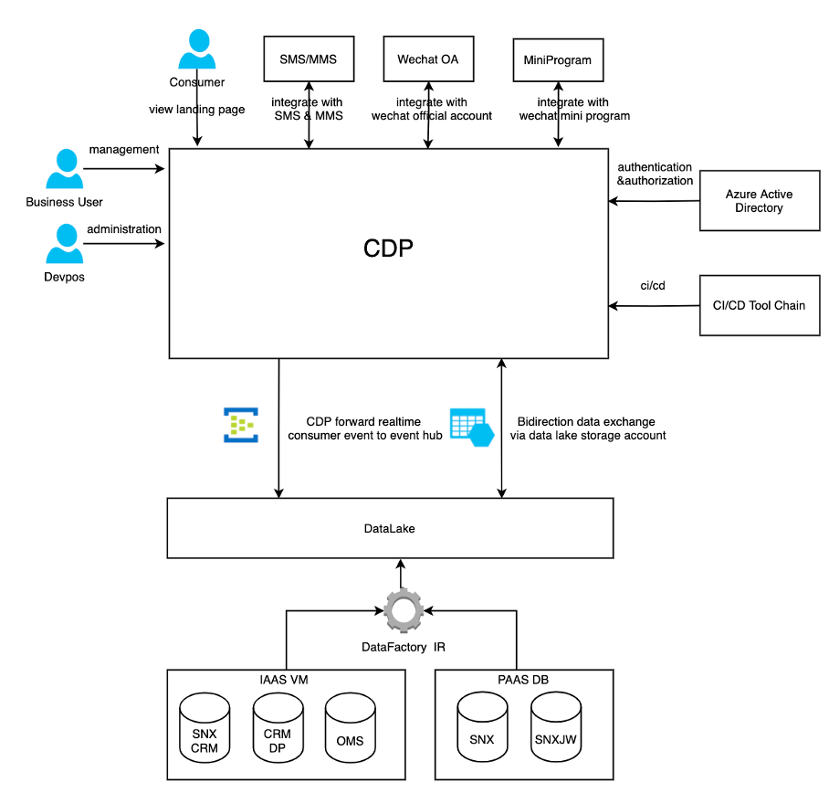
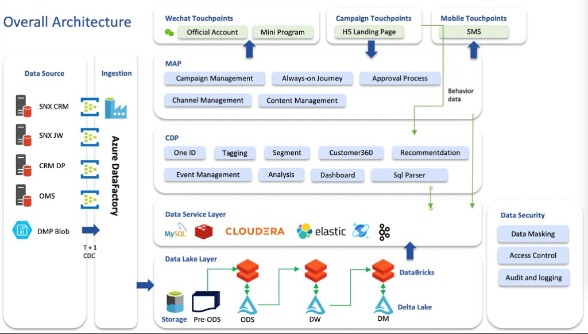
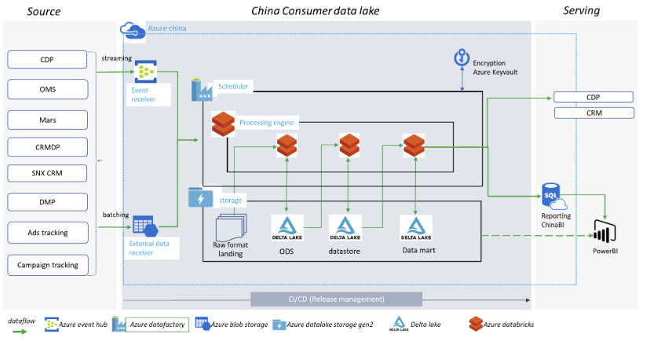
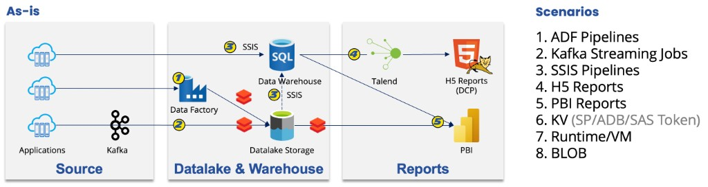
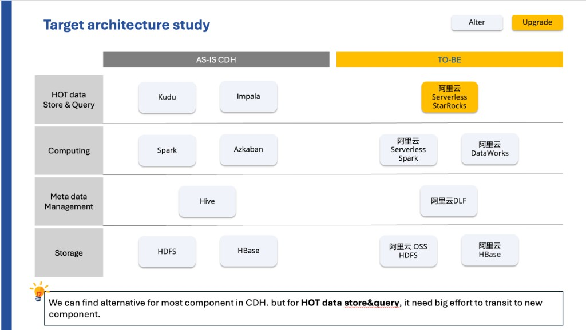
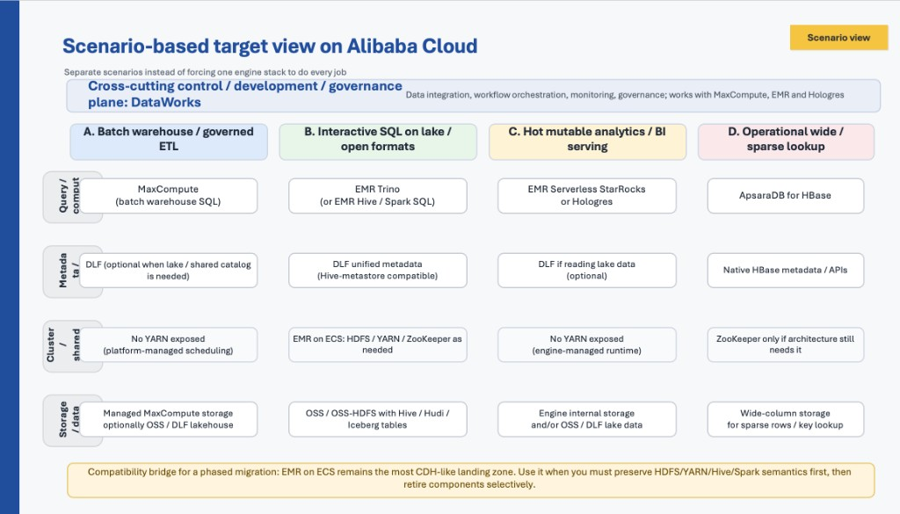
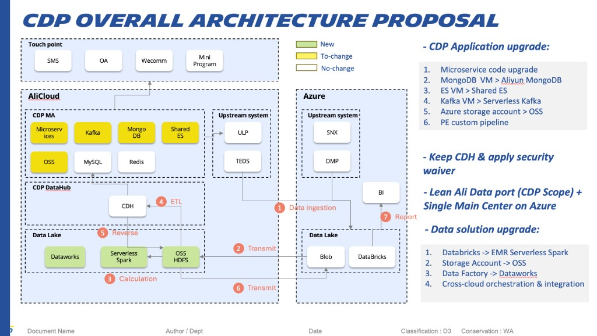

<!-- _class: lead -->
<!-- _paginate: false -->

# CDP Application Migration
## Heads-up & Context for the Infra Team

an early walkthrough of the planned change to the CDP application, so Infra has the big picture ahead of the migration project.

---

## Why CDP — Business Context

Michelin B2C is moving to a **Consumer Lifetime Value** model. Michelin China needs to:

- Deepen **direct** consumer relationships
- **Own** consumer data end-to-end
- Deliver a more **data-augmented** consumer experience

**The CDP application in scope is two layers working together**

| Layer | Role | Answers the question |
|-------|------|----------------------|
| **9DL** | Consumer **data lake** / data foundation | *How do we collect, clean, store, and serve China consumer data?* |
| **9CD** | Consumer **data platform** / activation layer | *How do we use that data to identify, segment, and engage consumers?* |

<strong>Coverage:</strong> 1st-party touchpoints + key 2nd/3rd-party ecosystems (Alibaba, Tencent, Bytedance, Bilibili, communities, selected offline).

<strong>Note:</strong> 9CD is <em>both</em> a <strong>data source</strong> and a <strong>data consumer</strong> of 9DL — the two layers are tightly coupled.

---

<!-- _class: split-context -->

## High-Level System Context Diagram

9DL — Data foundation

<ul>
<li>Centralize consumer data from all China touchpoints</li>
<li>Standardize dimensions, metrics, and data mappings</li>
<li>Cleanse and consolidate raw data</li>
<li>Expose curated datasets to <strong>CDP, BI, CRM</strong> and other consumers</li>
</ul>

9CD — Activation

<ul>
<li>Automatic <strong>consumer ID mapping &amp; merge</strong></li>
<li>Automatic <strong>tagging</strong> and <strong>segmentation</strong></li>
<li><strong>Journey orchestration</strong> (automated / personalized)</li>
<li><strong>Dynamic content</strong> across channels (WeChat, SMS, landing pages)</li>
</ul>

---

<!-- _class: diagram-slide -->

## Overall Architecture — End-to-End Flow
- **Sources** → **lakehouse** on storage (Pre-ODS / ODS / DW / DM with Databricks + Delta) → **data services** (MySQL, Redis, Cloudera, Elastic, Cosmos DB, Kafka) → **CDP** → **MAP** → **touchpoints**
- Behavior data closes the loop back to CDP. 

---

<!-- _class: cdh-slide -->

## 9CD / CDH — Key platform components

The <strong>9CD</strong> activation layer sits on a <strong>Cloudera Hadoop (CDH)</strong> cluster for large-scale storage and processing; these are the CDH-related building blocks from the component inventory (CDH and <code>CDH/…</code> services).

| Component Code | Component | Component details | Description |
| ---------------- | --------- | ----------------- | ----------- |
| C20 | CDH | Cloudera Hadoop platform |  |
| C21 | CDH/Impala | Interactive query engine | Apache Impala is the open source, native analytic database for Apache Hadoop. |
| C22 | CDH/kudu | Distributed data store engine | Apache Kudu is an open source distributed data storage engine that makes fast analytics on fast and changing data easy. |
| C23 | CDH/spark | Big data processing engine | A fast and general compute engine for Hadoop data. Spark provides a simple and expressive programming model that supports a wide range of applications, including ETL, machine learning, stream processing, and graph computation. |
| C24 | CDH/hdfs | Distributed file system | A distributed file system that provides high-throughput access to application data. |
| C25 | CDH/hbase | Distributed data store | A scalable, distributed database that supports structured data storage for large tables. |
| C26 | CDH/YARN | Resource Management | A framework for job scheduling and cluster resource management. |
| C27 | CDH/Hive | Hadoop data store engine | A data warehouse infrastructure that provides data summarization and ad hoc querying. |
| C28 | CDH/Zookeeper | coordination service | A high-performance coordination service for distributed applications. |
| C29 | CDH/ClouderaManager | Hadoop management tool | Cloudera Manager is the industry's trusted tool for managing Hadoop in production. |

---

<!-- _class: arch-9dl -->

## 9DL — Data Lake Architecture (Azure China)
 

How the consumer <strong>9DL</strong> platform is put together: ingestion → lakehouse storage on <strong>ADLS Gen2</strong> (Delta) → serving.

 

<ul>
<li><strong>Ingestion:</strong> batch via external receiver (Blob) and <strong>streaming</strong> via Event Hubs</li>
<li><strong>Orchestration &amp; compute:</strong> <strong>Data Factory</strong> (scheduler) and <strong>Databricks</strong> for transforms</li>
<li><strong>Storage (Gen2):</strong> <strong>Raw</strong> landing → <strong>ODS</strong> → <strong>datastore</strong> → <strong>Data mart</strong> — modeled as <strong>Delta Lake</strong> tables on ADLS</li>
<li><strong>Platform:</strong> <strong>Key Vault</strong> for secrets/encryption; <strong>CI/CD</strong> for release management</li>
<li><strong>Serving:</strong> <strong>CDP</strong>, <strong>CRM</strong>, SQL reporting (<strong>ChinaBI</strong>), <strong>Power BI</strong></li>
</ul>

---

<!-- _class: asis-hybrid -->

## As-Is Reality — Hybrid Chain
 
The real estate today is a hybrid **lake + warehouse + app-serving chain** with multiple delivery paths.

- **9DL ↔ 9CD is bidirectional.**  9DL/ADLS = secondary storage for 9CD/CDH.
- **9CD has its own data gravity.** Substantial processing happens inside 9CD — Kafka, CDH (Spark / HDFS / HBase / Kudu), MySQL, MongoDB, Redis, ElasticSearch — not always lake-first.
- **Parallel reporting chain** exists alongside the lake: **9RR Data Warehouse · SSIS · Talend · H5 Tomcat · Power BI**.
- **Six runtime patterns** observed in operations, ranging from 
  - `Source → Kafka → 9DL → Power BI` to 
  - `Source → ADF/Databricks → 9DL → 9RR → Talend → H5 → Power BI`.

 
 

---

<!-- _class: prestudy-slide -->

## Migration Pre-study from Michael Zhao

<strong>Rough effort (order-of-magnitude):</strong>
<ul>
<li><strong>DEV — Microservices</strong> (6 services): ~<strong>50</strong> dev MD</li>
<li><strong>DEV — ETL</strong> (all ETL adjustment): ~<strong>55</strong> dev MD</li>
<li><strong>E2E test</strong> (CI/CD): ~<strong>20</strong> tester MD + ~<strong>10</strong> dev MD</li>
<li><strong>Deployment</strong> (data migration): ~<strong>5</strong> dev MD</li>
<li><strong>Totals:</strong> ~<strong>20</strong> tester MD · ~<strong>120</strong> dev MD</li>
</ul>

---

<!-- _class: diagram-slide -->

## Proposed Due Diligence Study

*Scenario-based target view on Alibaba Cloud — separate scenarios instead of forcing one engine stack to do every job.*

---

## Guiding Principles of Max Yang (based on above CDH plan)

**Bottom line:** *not* "move everything from Azure to Ali."

- Keep **Azure 9DL** as the **primary enterprise lakehouse** and **governance center**
- Add a **lean, bounded** Ali-side capability for CDP-local / Ali-native workloads
- Move **selected** CDP components to Ali-native managed services
- **Do not build a second enterprise data lake** on Ali
- Keep **CDH** for now, under security waiver — not replaced in this phase

**Guiding principle:** *workload decentralization, governance centralization.*

**What stays Azure-led (guardrails)**
9DL as primary lakehouse · centralized governance · enterprise BI / reporting · metric & KPI consistency · Ali is an **extension**, not a peer enterprise platform.

---

<!-- _class: diagram-slide -->

## Overall Architecture

*CDP overall architecture proposal — AliCloud (CDP MA, DataHub, lean Ali data port) + Azure (main lakehouse / BI); legend: green = new, yellow = to-change, white = no-change.*

---

## Change Map — Four Domains at a Glance

| # | Domain | Summary of change |
|---|--------|-------------------|
| **A** | **CDP runtime middleware** | VM-based components → Ali **managed services** |
| **B** | **CDP data processing (Ali side)** | Azure tooling → **Ali-native** data path |
| **C** | **Azure 9DL (parallel)** | **Modernize** lakehouse — not freeze |
| **D** | **CDH disposition** | **Keep** under waiver; defer full replacement |

**Cross-cutting placement rule**
If data is **sourced from Ali** and **only used by CDP**, it is processed **on Ali only** — the corresponding ETL jobs are removed from Azure.

---

<!-- _class: domains-slide -->

## Domains A & B — Ali-Side CDP Changes

A) Runtime middleware → Alibaba managed services

| Current | Target (Alibaba) |
|---------|------------------|
| MongoDB VM | Aliyun MongoDB |
| ElasticSearch VM | Shared ES |
| Kafka VM | Serverless Kafka |
| Azure Storage Account | OSS |
| — | PE custom pipeline adjustment |

B) CDP data processing → Alibaba-native path

| Current (Azure) | Target (Alibaba) |
|-----------------|------------------|
| Databricks | EMR Serverless Spark |
| Storage Account | OSS / OSS-HDFS |
| Data Factory | DataWorks |
| — | **New:** Flink + Fluss · Hive Metastore · Hologres |

Plus <strong>cross-cloud orchestration &amp; integration</strong> between Azure and Alibaba for workloads that stay Azure-centered.

---

<!-- _class: domains-slide -->

## Domains C & D — Azure Modernization + CDH Disposition

C) Azure 9DL — modernize in parallel (not frozen)

<ul class="domains-list">
<li>Enable <strong>Unity Catalog</strong></li>
<li>Complete <strong>N3 migration</strong></li>
<li>Adopt <strong>Iceberg</strong> as the standard table format</li>
<li>Direct integration with <strong>CDL</strong></li>
<li>Decommission SQL Server → use <strong>ADB SQL Warehouse</strong> as report DB</li>
<li>Move toward <strong>Power BI semantic models</strong> and governed datasets</li>
</ul>

D) CDH — no replacement in this phase

<ul class="domains-list">
<li><strong>Keep CDH</strong> under a security <strong>waiver / transitional stance</strong></li>
<li>Avoid destabilizing the enterprise center to chase CDH replacement now</li>
<li>Scenario-based future mapping — see <strong>Proposed Due Diligence Study</strong> slide (<strong>reference only</strong> for this phase)</li>
</ul>

<strong>Reporting back-flow:</strong> If BI needs CDP-computed data, <strong>daily sync Alibaba → Azure</strong>. <strong>Gold / Serving layer only.</strong> Copy-as-delivery.

---

## Next Steps & Open Floor

**Now — your turn**

Questions, concerns, and early flags welcome. Anything that already looks risky or ambiguous from an infra standpoint, please raise it so we can factor it into the migration plan.
