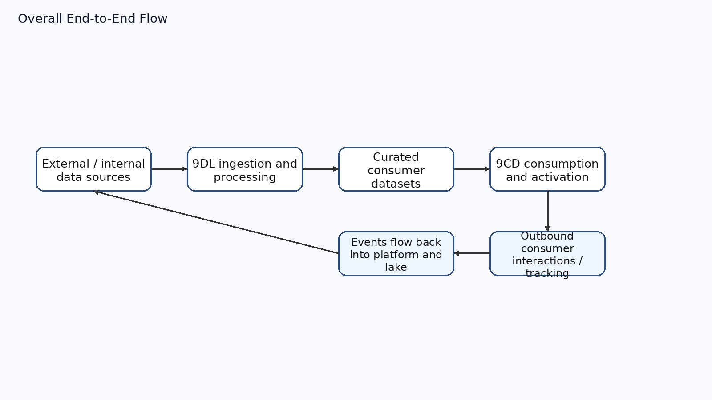

<!-- _class: lead -->
<!-- _paginate: false -->

# CDP Application Migration
## Heads-up & Context for the Infra Team

**What this session is:** an early walkthrough of the planned change to the CDP application, so Infra has the big picture ahead of the migration project.

**What we want from you:** questions, clarifications, and early flags on anything that impacts infra readiness.

**Not today:** detailed target architecture, sizing, or cutover plan — those come in follow-up sessions.

---

## 1. Why We're Migrating — Business Context

**Business driver**
Michelin B2C is moving to a **Consumer Lifetime Value** model. Michelin China needs to:

- Deepen direct consumer relationships
- **Own** consumer data end-to-end
- Deliver a more **data-augmented** consumer experience

**The CDP application in scope is two layers working together**

| Layer | Role | Answers the question |
|-------|------|----------------------|
| **9DL** | Consumer **data lake** / data foundation | *How do we collect, clean, store, and serve China consumer data?* |
| **9CD** | Consumer **data platform** / activation layer | *How do we use that data to identify, segment, and engage consumers?* |

**Coverage:** 1st-party touchpoints + key 2nd/3rd-party ecosystems (Alibaba, Tencent, Bytedance, Bilibili, communities, selected offline).

**Note:** 9CD is *both* a **data source** and a **data consumer** of 9DL — the two layers are tightly coupled.

---

## 1. What Each Layer Must Deliver After Migration

**9DL — Data foundation**
- Centralize consumer data from all China touchpoints
- Standardize dimensions, metrics, and data mappings
- Cleanse and consolidate raw data
- Expose curated datasets to **CDP, BI, CRM** and other consumers

**9CD — Activation**
- Automatic **consumer ID mapping & merge**
- Automatic **tagging** and **segmentation**
- **Journey orchestration** (automated / personalized)
- **Dynamic content** delivery across channels (WeChat, SMS, landing pages)

**What this means for Infra**
A stable, secure, observable, China-compliant platform that supports both **batch + streaming** data workloads *and* **microservices on Kubernetes** — with clean separation between the lake (9DL) and the activation platform (9CD).

---

## 2. High-Level Data Flow — Design Intent

**The intended loop:** sources → 9DL ingest/process → curated data → 9CD activation → consumer channels → events flow back into the lake.

**Important:** this is the **design intent**. The actual as-is estate is more nuanced — see the next slide before making infra assumptions.

---

## 3. As-Is Reality — Hybrid Chain, Not a Clean Pipeline

The real estate today is a **hybrid lake + warehouse + app-serving chain** with multiple delivery paths.

- **9DL ↔ 9CD is bidirectional.** 9CD is both a source and a consumer of the lake; 9CD/CDH reads 9DL ADLS via service principal (ADLS = secondary storage for CDH).
- **9CD has its own data gravity.** Substantial processing happens inside 9CD — Kafka, CDH (Spark / HDFS / HBase / Kudu), MySQL, MongoDB, Redis, ElasticSearch — not always lake-first.
- **Parallel reporting chain** exists alongside the lake: **9RR Data Warehouse · SSIS · Talend · H5 Tomcat · Power BI**.
- **Six runtime patterns** observed in operations (from monitoring), ranging from `Source → Kafka → 9DL → Power BI` to `Source → ADF/Databricks → 9DL → 9RR → Talend → H5 → Power BI`.

**Why this matters for infra migration**
Scope is not just "lift 9DL". It includes untangling **9DL ↔ 9CD ↔ 9RR / reporting** interactions and the operational patterns that have accreted around them.

---

## 4. Main Components — Combined Logical View

**Key infra building blocks to plan for**
- **Azure-native (9DL):** Blob, Event Hub, ADF, ADLS Gen2, Databricks, Self-hosted IR, Key Vault, Azure AD
- **Kubernetes / CaaS (9CD):** microservices fronted by Application Gateway
- **Data middleware:** Kafka · Redis · MySQL · MongoDB · ElasticSearch
- **Big-data engine inside 9CD:** CDH (Spark / HDFS / HBase / Kudu) — non-trivial footprint, uses 9DL ADLS as secondary storage
- **Adjacent reporting stack:** 9RR DW · SSIS · Talend · H5 Tomcat · Power BI
- **Identity & secrets:** Azure AD · Key Vault
- **CI/CD context:** Jenkins · GitLab · Artifactory

---

## Next Steps & Open Floor

**Coming in follow-up sessions**
- As-Is vs To-Be infra inventory (component by component)
- Mapping of the **six runtime patterns** and the **9RR / SSIS / Talend / H5 / Power BI** chain
- 9DL ↔ 9CD integration contracts (service principal, ADLS access, Kafka, etc.)
- Network & security topology, China compliance considerations
- Migration phases, dependencies, and cutover approach
- Capacity, sizing, SLOs, and observability requirements

**Now — your turn**
Questions, concerns, and early flags welcome. Anything you see here that already looks risky or ambiguous from an infra standpoint, please raise it so we can factor it into the migration plan.
